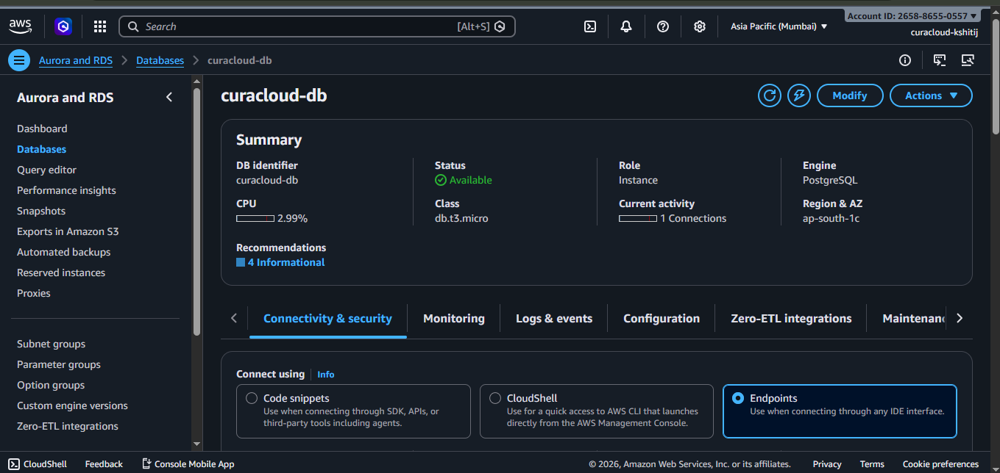
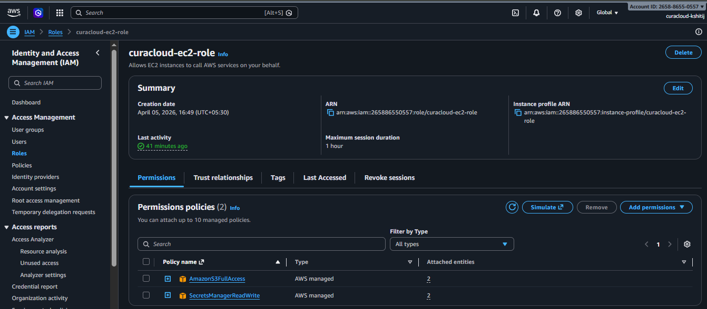
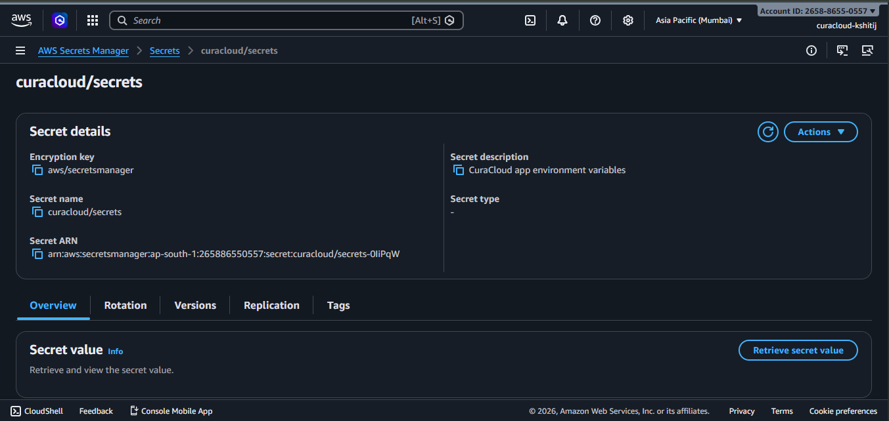
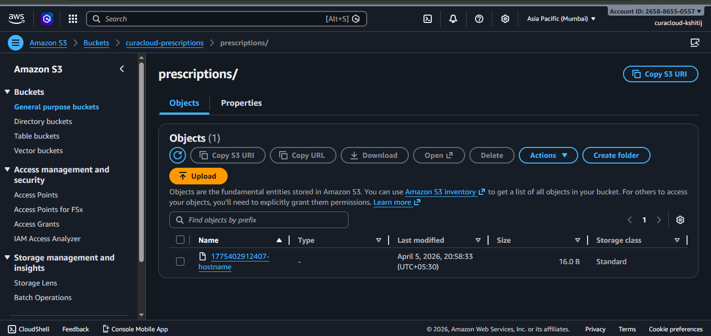
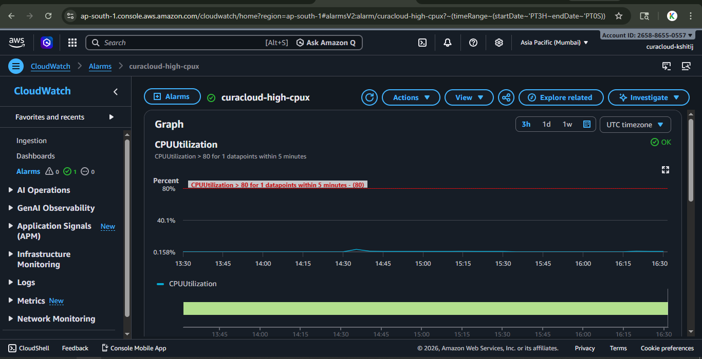
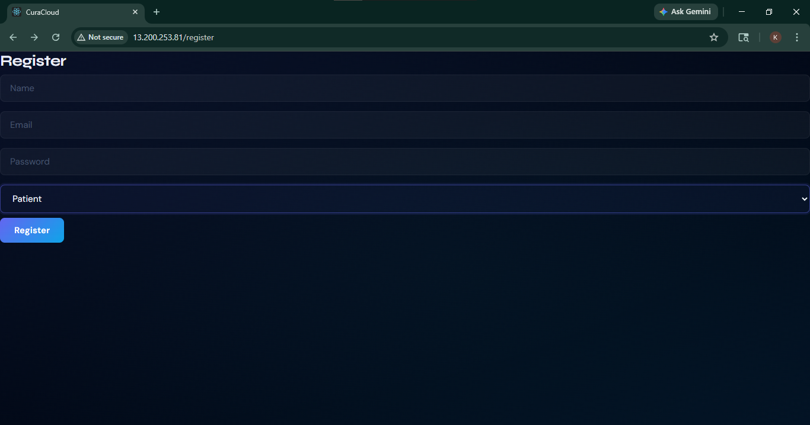

# CuraCloud 🏥

A full-stack healthcare web application deployed on AWS with a containerized, production-grade cloud infrastructure.

> **Note:** This repository documents my contribution as the **Cloud & DevOps Engineer** on a team of 4. The application was built collaboratively — my teammates built the React frontend and Node.js/Express backend, while I was solely responsible for the entire cloud infrastructure and deployment pipeline.

---

## 🏗️ Architecture Overview

```
                        ┌─────────────────────────────────────────┐
                        │               AWS (ap-south-1)           │
                        │                                          │
  User                  │   EC2 Instance                           │
   │                    │   ┌─────────────────────────────────┐    │
   │  HTTP :80          │   │  Docker Compose                  │   │
   └──────────────────► │   │  ┌──────────┐  ┌─────────────┐ │   │
                        │   │  │  Nginx   │  │   React     │ │   │
                        │   │  │ (Reverse │──│  Frontend   │ │   │
                        │   │  │  Proxy)  │  └─────────────┘ │   │
                        │   │  │          │  ┌─────────────┐ │   │
                        │   │  │          │──│  Node.js /  │ │   │
                        │   │  └──────────┘  │   Express   │ │   │
                        │   │                └──────┬──────┘ │   │
                        │   └───────────────────────┼────────┘   │
                        │                           │             │
                        │   ┌───────────────────────▼──────────┐  │
                        │   │  AWS RDS (PostgreSQL)             │  │
                        │   │  Port 5432 — EC2 access only      │  │
                        │   └──────────────────────────────────┘  │
                        │                                          │
                        │   ┌──────────┐   ┌────────────────────┐ │
                        │   │    S3    │   │  Secrets Manager   │ │
                        │   │ (Files)  │   │  (Credentials)     │ │
                        │   └──────────┘   └────────────────────┘ │
                        │                                          │
                        │   ┌──────────────────────────────────┐   │
                        │   │  CloudWatch + SNS Alerts          │   │
                        │   └──────────────────────────────────┘   │
                        └─────────────────────────────────────────┘
```

---

## ☁️ My Cloud & DevOps Contributions

### 1. Containerization with Docker
- Wrote individual **Dockerfiles** for the React frontend and Node.js/Express backend
- Set up **Docker Compose** to orchestrate all containers (frontend, backend, Nginx)
- Configured **Nginx as a reverse proxy** to route traffic between services and serve the frontend
- Tested the full multi-container setup locally before pushing to production

### 2. EC2 Deployment (ap-south-1)

- Launched and configured an **AWS EC2** instance in the Mumbai region
- Set up **Security Groups** with minimal exposure:
  - Port 80 (HTTP) open to the public
  - Port 22 (SSH) restricted to my IP address only
- Deployed the Dockerized application on EC2 using Docker Compose

### 3. Managed Database with AWS RDS

- Set up a **PostgreSQL instance on AWS RDS** — separated from EC2 for reliability and managed backups
- Configured **VPC Security Groups** so only the EC2 instance can reach RDS on port 5432
- Database is not publicly accessible

### 4. IAM — Least Privilege Access

- Created an **IAM user** with only the permissions required for deployment tasks
- Created an **IAM role** with least-privilege policies and attached it directly to the EC2 instance
- EC2 accesses AWS services (S3, Secrets Manager) via the instance role — no hardcoded credentials anywhere

### 5. Secrets Management

- Stored all credentials (DB connection string, API keys) in **AWS Secrets Manager**
- Backend application fetches secrets at runtime — no `.env` files or plaintext credentials in the codebase or environment

### 6. S3 for File Storage

- Created an **S3 bucket** for prescription file uploads
- Backend generates **presigned URLs** for secure, time-limited access to uploaded files — users never get direct S3 access

### 7. Monitoring & Alerts

- Configured a **CloudWatch alarm** on EC2 CPU utilization
- Connected alarm to an **SNS topic** with email notifications so the team gets alerted on high load

### 8. Git Workflow
- Followed a disciplined **branching strategy** — all my work was done on a `kshitij-cloud` branch
- Never pushed directly to `main`; all changes went through pull requests
- Deployment flow: local machine → GitHub → EC2

 ### 9. Working-app
 
---

## 🛠️ Tech Stack

| Layer | Technology |
|---|---|
| Frontend | React |
| Backend | Node.js, Express |
| Database | PostgreSQL (AWS RDS) |
| Containerization | Docker, Docker Compose |
| Reverse Proxy | Nginx |
| Cloud Provider | AWS (ap-south-1) |
| Compute | EC2 |
| Storage | S3 |
| Secrets | AWS Secrets Manager |
| IAM | IAM User + EC2 Instance Role |
| Monitoring | CloudWatch, SNS |
| Version Control | Git, GitHub |

---

## 🔒 Security Practices Applied

- No credentials in code or environment files — all secrets via AWS Secrets Manager
- EC2 Security Group exposes only port 80 publicly; port 22 is IP-restricted
- RDS is in a private VPC, accessible only from EC2 on port 5432
- S3 files accessed via presigned URLs — bucket is not publicly accessible
- IAM follows least privilege — EC2 role only has permissions it actually needs

---

## 👥 Team

Built by a team of 4 — I was responsible for the entire cloud and DevOps setup.
App development (React frontend, Node.js/Express backend) was handled by my teammates.
---

## 📌 Status

Deployed and running on AWS EC2 (ap-south-1).